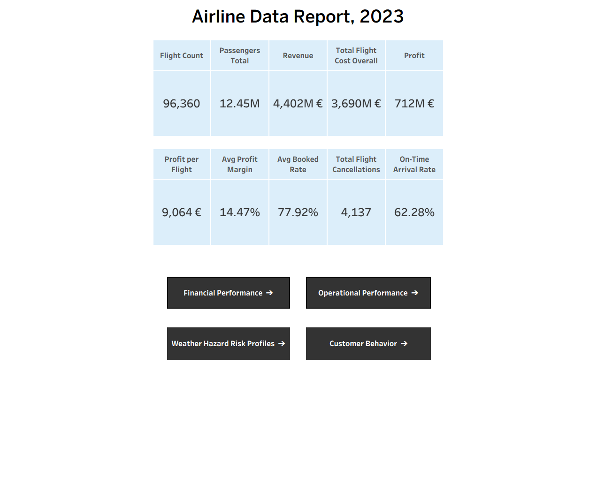
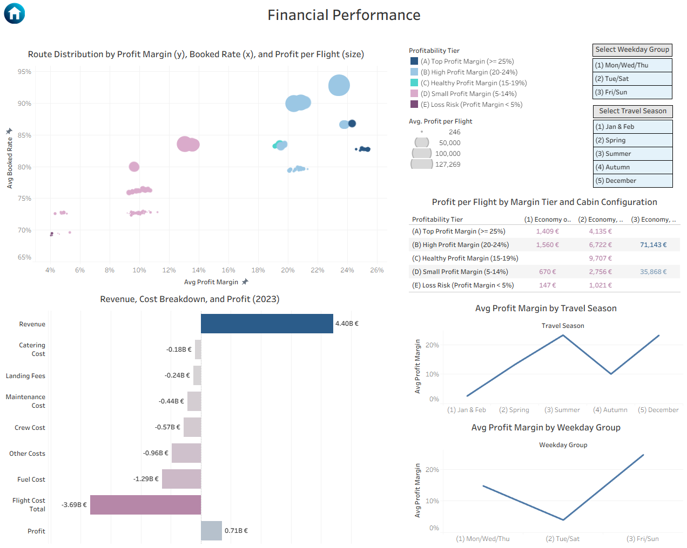
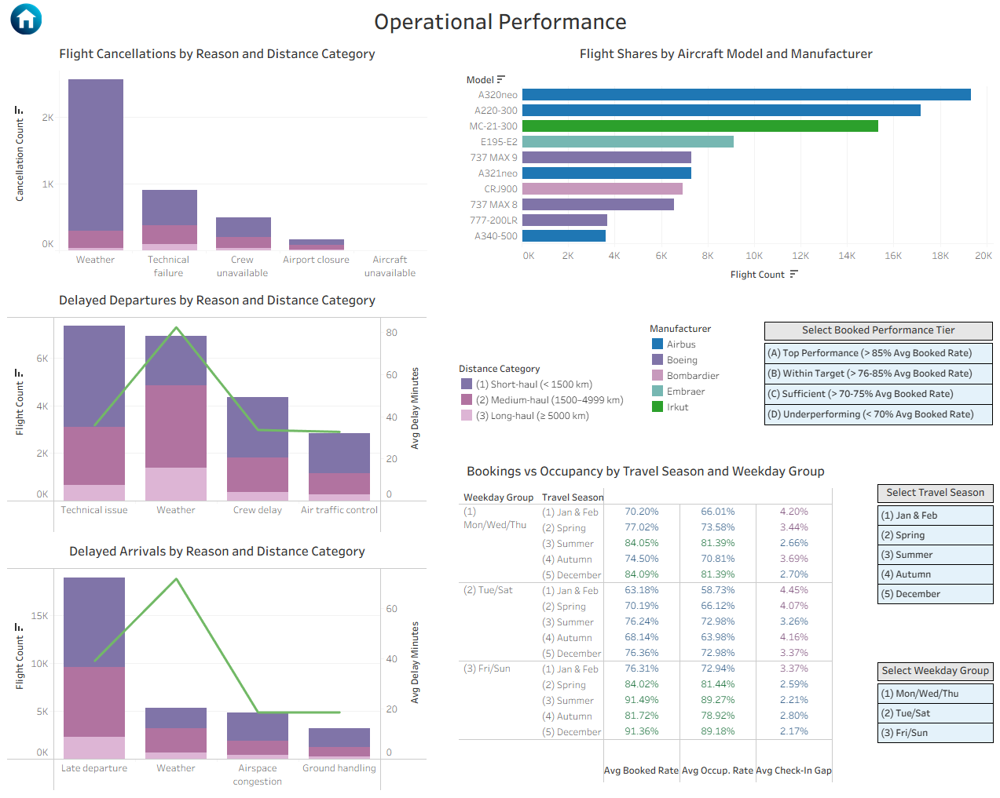
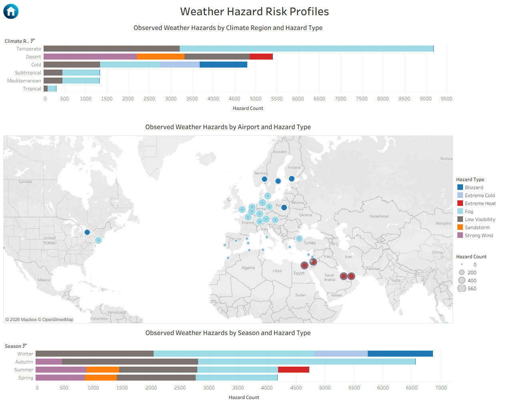
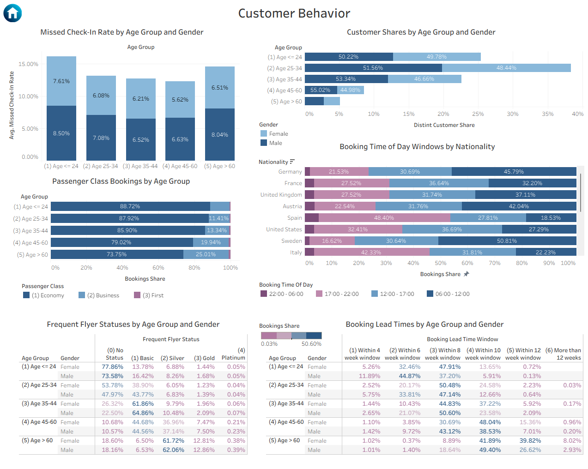

# Synthetical-Airline Data Report (Tableau Dashboard)

## Introduction

This project presents an interactive airline analytics dashboard built in Tableau, based on a synthetically generated 
airline dataset ([documented here](https://github.com/data-analysis-colab/database_creation_airline_python/blob/master/README.md)) 
designed to closely mirror real-world operational, financial, and customer behavior patterns.

The goal is to demonstrate end-to-end analytical workflow skills – from data preparation and modeling to dashboard 
design – while enabling realistic, multidimensional analysis without relying on proprietary data.

## Skills Demonstrated

- **Data Engineering & Preparation**
  - Transforming normalized source data into analysis-ready fact and dimension tables using Pandas
  - Designing flattened schemas optimized for BI tools
- **Data Modeling for BI**
  - Building a relational Tableau data model with consistent grain and reusable dimensions
  - Defining calculated fields and KPIs at appropriate semantic levels
- **Analytical Thinking**
  - Translating business questions into measurable performance indicators
  - Segmenting performance by time, route, aircraft, customer demographics, and external factors
- **Data Visualization & Dashboard Design**
  - Designing interactive dashboards with clear hierarchy, filters, and navigation
  - Balancing high-level KPIs with drill-down analytical views
- **Documentation & Reproducibility**
  - Clear separation of data preparation, modeling logic, and visualization layers
  - Supporting notebooks and markdown documentation for transparency and reuse

## Data Sourcing and Modelling

Data preparation and feature engineering were primarily performed in Pandas, with the final datasets exported for 
analysis and visualization in Tableau. Detailed transformation logic is documented separately and linked below:
- [Jupyter Notebook](tableau_prep.ipynb)
- [Data Preparation Overview](DATA_PREP_DETAILS.md)

This section summarizes the resulting data model, relationships, and key calculated fields used in Tableau.

### Route-Level Operational and Financial Data

The core analytical model is built around route-level fact data, using routes_lookup.csv as the central reference 
table. The following datasets are related to it:

    aircraft_usage.csv | flight_cancellations.csv | flight_delays.csv | route_facts.csv

All route-level tables are joined on:

    route_name_short | travel_season | weekday_group

This structure enables consistent comparison of financial performance, operational reliability, and demand patterns 
across time segments.

A small set of calculated fields was added to route_facts in Tableau to support KPI and dashboard logic, including:
- Booked Rate: `Bookings Total / Nominal Capacity Total`
- Occupancy Rate: `Passengers Total / Actual Capacity Total`
- Profit: `Total Revenue − Total Flight Cost Overall`
- Profit Margin: `Total Profit / Total Revenue`
- On-Time Arrival Rate: `On Time Arrivals Total / Flight Count`

These metrics form the basis of the Financial and Operational Performance dashboards.

### Customer Data

Customer-level analysis is centered on customers_lookup.csv, which is related to:

    customer_attributes.csv | customer_behavior.csv

Customer tables are joined on:

    frequent_flyer_status_code | age_group | gender | nationality

An additional behavioral metric was derived to support customer reliability analysis:
- Missed Check-In Rate: 1 − (Check-Ins / Bookings)

This enables demographic comparisons of booking intent versus actual travel behavior.

### Weather Hazard Data

Weather-related analysis uses a standalone dataset:

    weather_hazards.csv

This dataset is analyzed independently to examine the distribution of observed hazards by climate region, 
season, and airport, and is not directly joined to route or customer tables.

## Analysis and Visualisation

### 1. KPIs and Navigation

The landing page provides a compact executive overview of overall scale, profitability, and operational reliability.
It also serves as the central navigation hub, linking to the main analytical sections of the report.

### 2. Financial Performance

This dashboard analyzes route-level financial performance and its relationship with demand, capacity utilization, 
and cost structure.

It highlights:
- Differences in profitability across routes and cabin configurations
- The interaction between booked rates and profit margins
- Seasonal and weekday patterns in route profitability
- Interactive filters allow focused exploration by travel season and weekday group

### 3. Operational Performance

This dashboard examines operational reliability across the network, focusing on cancellations, delays, 
fleet utilization, and booking efficiency. It highlights how different disruption reasons (e.g. weather, technical 
issues) interact with flight distance, aircraft models, and time patterns, while allowing comparison of booking and 
occupancy behavior across travel seasons and weekday groups.

### 4. Weather Hazard Risk Profiles

This dashboard analyzes weather-related operational risk by combining hazard frequency with geographic and seasonal 
context. It shows how different climate regions, airports, and seasons are exposed to specific weather hazards, 
providing a high-level risk profile that connects environmental factors to potential operational impact.

### 5. Customer Behavior

This dashboard explores passenger behavior patterns across demographics, focusing on booking habits, class 
preferences, loyalty status, and check-in behavior. It reveals how age, gender, and nationality influence booking 
timing, lead times, and product mix, supporting more realistic segmentation and downstream behavioral analysis.

## Conclusion

This project demonstrates how a well-structured synthetic dataset can support realistic airline performance analysis 
across financial, operational, and customer dimensions.
It highlights a complete analytics workflow, from data preparation and modeling to the design of interactive, 
decision-oriented dashboards.